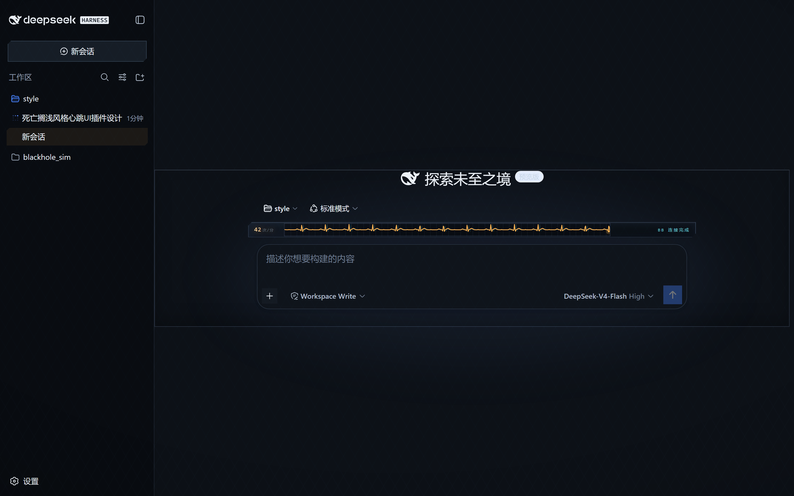

# CHIRAL PULSE · 手性脉冲

Death Stranding 皮肤 + BB 生命体征监护仪,挂在 [DeepSeek Harness](https://github.com/deepseek-ai/deepseek-harness) Web 界面。

- **全局皮肤**——整个界面都是死亡搁浅:暗色 DS 蓝黑机身 + 琥珀发丝线,亮色冥滩白变体;全屏扫描线、手性晶格、四角渐晕氛围层(全部 pointer-transparent,不挡操作);DeepSeek 鲸鱼品牌蓝原样保留。
- **心跳走纸**——输入区上方一条 26px 监护仪走纸:滚动 ECG 波形是主角,BPM 实时跟随 Agent 活动(思考 +38、工具执行 +52、回合进行 +10、空闲回落至 42)。数据全部来自会话快照,不重复 StatsLine 已有的 turns/tokens。



## 安装

发布版(推荐):

```sh
dsh plugin --profile web add chiral-pulse
```

包内声明了 `dsh.bundle`(cordis.patch.yml roster 行)与 `dsh.client`(浏览器半边),安装后自动进入 profile 的 bundle 层,无需手写配置。

旧写法 `dsh plugin --profile web chiral-pulse`(无 `add`)一并保留。

### 本地开发安装

把包链接进 profile 的 `node_modules`,再在 `$DSH_HOME/profiles/web/cordis.patch.yml` 追加一行:

```yaml
- insert:
    - id: ui-chiral-pulse
      name: 'chiral-pulse'
```

```powershell
New-Item -ItemType Junction -Path "$env:USERPROFILE\.dsh\profiles\web\node_modules\chiral-pulse" -Target "D:\path\to\chiral-pulse"
```

用户 patch 层热加载:无需重启 `dsh web`,刷新浏览器页面即可生效。

### 卸载

```sh
dsh plugin --profile web remove chiral-pulse
```

本地开发安装则移除 patch 行与 junction。

## 构建

```sh
pnpm bundle     # tsdown → lib/index.js + lib/client.js
pnpm typecheck  # tsc --noEmit
```

## 工作原理

- **主题**:ui-theme 设计平台里只重映射 `body[data-ds-dark-theme]` / `body:not([data-ds-dark-theme])` 两套静态色,全应用自动跟随;brand 蓝(鲸鱼)刻意不动;
- **数据**:`useProjection('sessionStats')` 提供活动窗口,`useSession` 快照驱动 BPM 加成,波形由纯函数 ECG 合成器(`src/client/ecg.ts`)生成;
- **渲染**:单 `<canvas>` 每帧直绘,erase-bar 扫掠 + 冻结像素缓存,帧率无关、零 DOM 抖动。

## 发布

打 tag(`v*.*.*`)→ GitHub Actions 自动构建、发布 npm 并创建 GitHub Release。

## License

MIT
